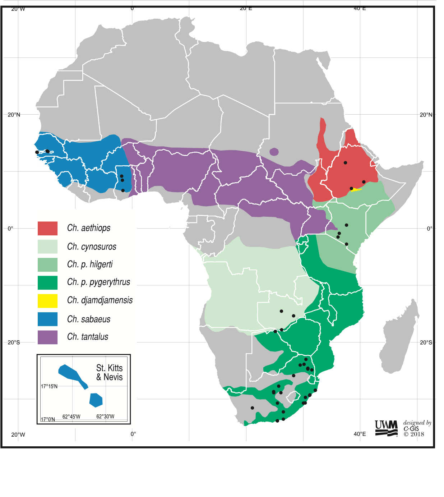
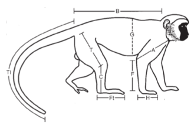
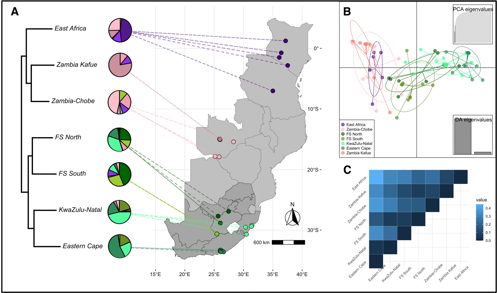
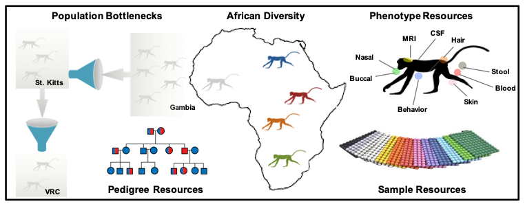

<!-- README.md is generated from README.Rmd. Please edit that file -->

# vervets

<!-- badges: start -->
<!-- badges: end -->


The goal of ‘vervets’ is to provide users with an easy and simple way to
learn about and use the extensive datasets and samples of wild savanna
monkeys (*Chlorocebus* spp., also commonly called ‘vervets’, even though
that term is technically limited to savanna monkeys occupying Eastern
Africa from Kenya down through South Africa, otherwise known as
*Chlorocebus pygerythrus*) generated by the **International Vervet
Research Consortium (IVRC)**.

There are datasets for teaching and exploration, as well as datasets
intended to design research projects with publicly available resources.
These datasets may also be linked to several others that are publicly
available in external online repositories (like
[EnsEMBL](https://useast.ensembl.org/Chlorocebus_sabaeus/Info/Index) and
[NCBI](https://www.ncbi.nlm.nih.gov/search/all/?term=Chlorocebus)). The
package will make clear when it needs to link out to external resources
(which may require an internet connection during use).

This package is currently in the early stages of development, so more to
come!

Please note that the data contained in the *vervets* package are
released under the terms of a Creative Commons Zero (CC0) waiver. In
doing so, we concur with Dryad’s logic regarding why this was chosen,
which you can read more about
[here](https://blog.datadryad.org/2011/10/05/why-does-dryad-use-cc0/).
In keeping with the norms of our academic discipline, we humbly ask that
you cite any associated papers when using data from *vervets* in your
own publications.

## Installation

You can install the development version of vervets from
[GitHub](https://github.com/) with:

``` r
# install.packages("pak")
pak::pak("fuzzyatelin/vervets")
```

## About the Data

<div class="wrap">



</div>

<style type="text/css">
.wrap {
    float: right;
    width: 350px;
    margin: 0px 0px -15px 10px;
}
</style>

The IVRC data represent body measurements, photographs, and a
comprehensive set of biological samples and their derived data (i.e.,
genome sequence data, gene expression data, microbiome data, hormone
data, and more) from over 2,300 wild savanna monkeys (*Chlorocebus*
spp.) representing numerous taxa across Africa and the Caribbean (see
inset map), collected by numerous associated research groups over the
course of decades of research. These data have been compiled and made
available for use within this package by IVRC member [Dr. Christopher A.
Schmitt](https://www.evopropinquitous.net) and founder [Dr. Trudy
Turner](https://uwm.edu/anthropology/people/turner-trudy-r/). You can
learn more about how the data were collected in one of the IVRC’s
summary papers by [Jasinska *et al.*
(2013)](https://doi.org/10.1093/ilar/ilt049), or in our book, [*Savanna
Monkeys*](https://doi.org/10.1017/9781139019941).

These numerous datasets are linked by two important indexing numbers.
The first is an `animal_id`, which identifies individual monkeys and
allows you to link numerous potential datasets that are derived from
measurements or samples collected on that individual monkey. The second
is a `collection_id`, which identifies a particular research effort or
field season that resulted in the collection of particular sets of
measurements, biological samples, and downstream data; this is important
given that *data from different collections may be subject to different
constraints or methods*.

Within the ‘vervet’ package itself, there are two main datasets, from
which we’ve derived a few helpful subsets:

``` r
library(vervets)
data(package = 'vervets')
```

One is called `vervets`, and is a simplified version of the larger raw
dataset; see `?vervets` for more info:

``` r
head(vervets)
```

The other is called `vervets_raw`, and contains all the variables and
names as originally downloaded; see `?vervets_raw` for more info:

``` r
head(vervets_raw)
```

Both datasets contain, in all, data for 2,315 savanna monkeys. There are
several different taxa of savanna monkey in this dataset, collected from
across Africa and the Caribbean.

**MORE DETAIL ON THE DATASET… including animalID naming convention with
map, whole genome phylogeny, and a guide to the collections**

### Morphological Datasets

We’ve included potentially helpful subsets of cleaned morphometic data
that, in addition to addressing novel research questions, may be used to
teach and/or replicate key analyses from papers published by IVRC
members, including:

<div class="wrap1">



</div>

<style type="text/css">
.wrap1 {
    float: left;
    width: 200px;
    margin: 25px 30px 25px 1px;
}
</style>

- `Turner1997`, representing a subset of 367 vervet monkeys from four
  sites in Kenya, which can be used to replicate the [Turner *et al.*
  (1997)](https://doi.org/10.1002/(SICI)1096-8644(199705)103:1%3C19::AID-AJPA3%3E3.0.CO;2-8)
  paper on vervet monkey body size and growth.
- `Turner2018`, representing a subset of 1,253 savanna monkeys from four
  taxa (*C. aethiops* in Ethiopia, *C. pygerythrus hilgerti* in Kenya,
  *C. pygerythrus pygerythrus* in South Africa, and *C. sabaeus* in
  St. Kitts & Nevis), which can be used to replicate the [Turner *et
  al.* (2018)](https://doi.org/10.1002/ajpa.23459) paper on savanna
  monkey body size and growth across their whole range (see [Schmitt *et
  al.* (2021)](https://doi.org/10.5061/dryad.vt4b8gtss) for associated R
  code).

For these morphological datasets, we follow the protocol recommendations
of the [Bones and Behavior Working
Group](https://wp.nyu.edu/csho/research/bones-and-behavior-working-group/)
for standardized anthropometric body measurements on living non-human
primates. For more details, you can also see the methods outlined by
Turner *et al.* (1997), and further described by Turner *et al.* (2018).

### Genetic/Genomic Datasets

<div class="wrap2">



</div>

<style type="text/css">
.wrap2 {
    float: right;
    width: 400px;
    margin: 0px 0px 0px 10px;
}
</style>

One of the key foci of the IVRC was to develop savanna monkeys as a
genetic/genomic resource. In fact, we chose savanna monkeys in part due
to their relatively unique population history, which makes them
particularly compelling as a genetic model system. This includes their
wide ecogeographic range across Africa, of course, but also a key
bottleneck that occurred when green monkeys (*Chlorocebus sabaeus*) were
opportunistically brought to the Caribbean from West Africa during the
Trans-Atlantic slave trade ~400 years ago. These monkeys quickly adapted
to the islands and soon took root, but with very reduced genetic
diversity, making them a great system in which to establish connections
between trait variation and the genetic variation that might underlie
it.

#### Captive Genetic/Genomic Data

A second bottleneck occurred when 67 of those monkeys from St. Kitts
were brought to the United States to create a captive research colony at
the University of California - Los Angeles in the mid-1970’s. The
[Vervet Research
Colony](https://school.wakehealth.edu/departments/pathology/comparative-medicine/vervet-research-colony)
(now housed at the Wake Forest School of Medicine) is a captive breeding
colony of ~250 green monkeys with an extensive pedigree dating back to
the initial founding of the colony. With over 1,000 monkeys pedigreed,
721 of which are whole genome sequenced, the colony a fantastic system
for investigating genetic links to behavior and biology, particularly in
biomedical contexts. The VRC data, however, are generally not publicly
available are so are not available in this package.

#### Wild Genetic/Genomic Data

The IVRC has generated both a [reference sequence (ChlSab
1.1)](https://pubmed.ncbi.nlm.nih.gov/26377836/) and [whole genome
population resequencing](https://pubmed.ncbi.nlm.nih.gov/29083404/) for
163 wild savanna monkeys. Including raw sequencing reads in this package
would make it prohibitively large, but the package includes instructions
for how to access those raw data for download (i.e., links to SRAs in
free online repositories) and for how to download those data directly
into R.

We also include a published VCF (Variant Call Format) data set of the
population resequencing for 163 individuals, called `Svardal2017`, along
with an associated `vervet population panel` file to link sex and
population assignments to the whole genome VCF data.

These data can be used as a teaching dataset for population genetics
(see [Schmitt *et al.* (2022)](https://doi.org/10.5061/dryad.k3j9kd59z)
for associated R code), or be combined with our other datasets to set up
novel analyses of how genetic variation may vary across populations in
relation to climatic or phenotypic data (as in [Gagnon *et al.*,
2022](https://royalsocietypublishing.org/doi/10.1098/rspb.2022.1254)).

### Biological Sample Repositories

<div class="wrap2">



</div>

<style type="text/css">
.wrap2 {
    float: right;
    width: 400px;
    margin: 0px 0px 0px 10px;
}
</style>

When IVRC members trap vervets, we collect a wide variety of biological
samples to make the most of our efforts. Although many samples are
immediately slated for processing to answer specific questions, many of
these processes either do not use up a whole sample, or may use.
derivative of a sample leaving a lot of biological material left over
that can be used in other analyses. A major goal of the ‘vervets’
package is to help make other researchers aware of the samples
available, and try to design potential experiments with available
archived samples so that they might be put to use!

At the moment, we have three major sample archives, each with numerous
sample types:

- **The International Vervet Research Consortium Sample Archive** is
  held by the [Biological Samples Processing
  Core](https://www.semel.ucla.edu/research/core/biological-samples-processing-core-–-bspc)
  at UCLA’s Semel Institute for Neuroscience and Human Behavior in Los
  Angeles, California in the United States. This public archive was
  generated by NIH funding (R01RR0163009; 2T32NS048004-06A1) and is the
  result of years of intensive sampling of over 2,500 wild savanna
  monkeys (*Chlorocebus* spp.) across Africa and the Caribbean. The
  majority of the archive was generated by researchers at the UCLA
  Center for Neurobehavioral Genetics, the University of Wisconsin -
  Milwaukee, and the University of the Free State, in association with
  the IVRC. It is comprised of fibroblast cell lines, blood samples
  (PAXgene DNA, PAXgene RNA, plasma clots, serum clots, spun down
  plasma, spun down serum), tissue samples (3mm ear punches), and
  microbiome swabs (vaginal, rectal, tongue, buccal, nasal), and fecal
  samples stored in both RNAlater and ethanol. Currently, this sample
  archive is under the curation of [Anna
  Jasinska](https://www.profiles.dom.pitt.edu/faculty_info.aspx/Jasinska7405)
  (University of Pittsburgh). Associated hair samples and dried blood
  spots from these collections are held at BU SMAGL in the Trudy Turner
  Vervet Monkey Sample Archive.

- **The Trudy Turner Vervet Monkey Sample Archive** is held at the
  Sensory Morphology and Aanthropological Genomics Lab (SMAGL) at Boston
  University in Boston, Massachusetts in the United States, and curated
  by [Dr. Christopher A. Schmitt](https://www.evopropinquitous.net).
  This public sample archive was generated by Trudy R. Turner
  (Distinguished Professor Emeritis at University of Wisconsin,
  Milwaukee) during over 60 years of working with wild savanna monkeys
  (*Chlorocebus* spp.), including a large portion generated while part
  of the IVRC. The archive is comprised of thousands of wild vervet
  samples from across Africa and the Caribbean, predominantly clipped
  fur samples and dried blood spots. These samples were generated by
  funding from the NIH (R01RR01163009), NSF (SOC-74-24166, BNS-770-3322,
  BCS-0938969), the University of Wisconsin – Milwaukee, the University
  of the Free State (South Africa), the University of Limpopo (South
  Africa), and the Coriell Institute.

- **The Vervet Monkey Plasma Clot Archive** is held by the [University
  of Pretoria Veterinary Genetics
  Lab](https://www.up.ac.za/the-onderstepoort-veterinary-genetics-laboratory)
  in Onderstepoort, South Africa. This archive was begun in association
  with the production of microsatellite markers from wild vervet monkeys
  (*Chlorocebus pygerythrus pygerythrus*) collected in Soetdoring Nature
  Reserve, a private farm in Gariep Dam, and Sandveld Nature Reserve,
  South Africa. These markers were generated from plasma clots from wild
  collections, with funding from Boston University, and in agreement
  with UPVGL standards the source clots are now part of their public
  sample archive and under their curation. These samples were generated
  by funding from Boston University.

- **The BU/NWU Vervet Monkey Sample Archive** is currently held at the
  Microbiology Department of North-West University in Potchefstroom,
  South Africa (soon to be accessioned into the [South African National
  Biodiversity Institute](https://www.sanbi.org)). This soon-to-be
  public sample archive is generated by and under the curation of
  [Dr. Christopher A. Schmitt](https://www.evopropinquitous.net) at
  Boston University and [Prudent
  Mokgokong](https://natural-sciences.nwu.ac.za/unit-environmental-sciences-and-management/prudent-mokgokong)
  at North-West University. The archive includes all physical data
  collected during their research on wild vervet monkeys (*Chlorocebus
  pygerythrus pygerythrus*) in South Africa. The archive is comprised of
  blood samples (PAXgene DNA, PAXgene RNA, plasma clots, serum clots,
  spun down plasma, spun down serum), tissue samples (3mm ear punches),
  hair samples, dried blood spots, microbiome swabs (vaginal, rectal,
  tongue, buccal, nasal), and fecal samples stored in both RNAlater and
  ethanol. Although these samples will be embargoed while still being
  analyzed by BU/NWU, they will become a public archive under SANBI
  curation upon associated publication. These samples were generated by
  funding from Boston University, The Leakey Foundation, and the
  National Geographic Society.

### Other Datasets

Additional datasets have been or are in the process of being generated
from our standing biological sample repositories that are associated
with those already present in the ‘vervets’ package! Typically, we wait
until collaborators have the chance to publish based on any
newly-generated data prior to adding them to the package. Once those
collaborators publish, however, we plan to integrate them into the
package so they will be similarly available and/or at least linked to
the already-existing dataset.

Coming additions for future builds of this package will include or
direct users to links to:

- Hormone data derived from hair (testosterone, cortisol, progesterone)
- Mitogenome sequence data
- Gut microbiome data
- Oral microbiome data
- Vaginal microbiome data
- Novel morphometric data from wild South African vervets

Please do not ask the package maintainers regarding when those data will
be added; package updates will make it clear when they have become
available!

## Citation

To cite the *vervets* package, please use:

``` r
citation("vervets")
```

## Additional Data Use Information

Anyone interested in publishing based on these data are strongly
encouraged to contact [Dr. Christopher
Schmitt](https://www.evopropinquitous.net) about analysis and and
potentially collaboration on any final products (beyond appropriate
citation of associated literatures). We may know nuances about the
datasets that might be important for your analyses!

## References

Where possible, publications for relevant data are available within the
package. The following citations are also generally useful to read to
learn more about the IVRC and associated data:

- Gagnon CM, Svardal H, Jasinska AJ, Cramer JD, Freimer NB, Grobler JP,
  Turner TR, Schmitt CA. (2022). Evidence of selection in UCP1 gene
  region suggests local adaptation to irradiance rather than cold
  temperatures in savanna monkeys (*Chlorocebus* spp.). *Proc Royal Soc
  B* 289:20221254. <https://doi.org/10.1098/rspb.2022.1254>

- Jasinska AJ, Schmitt CA, Service SK, Cantor RM, Dewar K, Jentsch DJ,
  Kaplan JR, Turner TR, Warren WC, Weinstock, GM, Woods RP, Freimer NB.
  (2013). Systems biology of the vervet monkey. *ILAR / Natl Res
  Council* 54:122-143. <https://doi.org/10.1093/ilar/ilt049>

- Schmitt CA, Gagnon CM, Svardal H, Jasinska AJ, Cramer JD, Freimer NB,
  Grobler JP, Turner TR. (2022). Savanna monkey (*Chlorocebus* spp.)
  population genetics/genomics pipeline. *Dryad*.
  <https://doi.org/10.5061/dryad.k3j9kd59z>.

- Schmitt CA, Turner TR, Cramer JD, Lorenz J, Grobler JP, Freimer NB.
  Worldwide savanna monkey (*Chlorocebus* spp.) body measures. *Dryad*.
  <https://doi.org/10.5061/dryad.vt4b8gtss>

- Svardal H, Jasinska AJ, Apetrei C, Coppola G, Huang Y, Schmitt CA,
  Jacquelin B, Müller-Trutwin M, Weinstock G, Grobler JP, Wilson RK,
  Turner TR, Warren WC, Freimer NB, Nordborg M. Ancient hybridization
  and strong adaptation to viruses across African vervet monkey
  populations. (2017). *Nature Genetics* 49: 1705–1713.
  <https://doi.org/10.1038/ng.3980>

- Turner TR, Schmitt CA, Cramer JD, Lorenz J, Grobler JP, Jolly CJ, and
  Freimer NB. (2018). Morphological variation in the genus
  *Chlorocebus*: Ecogeographic and anthropogenically mediated variation
  in body mass, postcranial morphology, and growth. *American Journal of
  Physical Anthropology* 166: 682-707.
  <https://doi.org/10.1002/ajpa.23459>

- *Savanna Monkeys: The Genus Chlorocebus*. Editors: Turner TR, Schmitt
  CA, Cramer JD. Cambridge University Press.
  <https://doi.org/10.1017/9781139019941>

- Warren WC, Jasinska AJ, Garcia-Perez R, Svardel H, Tomlinson C, Rocchi
  M, Archidiacono N, Capozzi O, Minx P, Montague MJ, Kyung K, Hillier
  LW, Kremitzki M, Graves T, Chiang C, Hughes J, Tran N, Wang Y,
  Ramensky V, Choi O, Jung YJ, Schmitt CA, Juretic N, Wasserscheid J,
  Turner TR, Wiseman RW, Tuscher JJ, Karl JA, Schmitz JE, Zahn R,
  O’Connor DH, Redmond E, Nisbett A, Jacquelin B, Müller-Trutwin MC,
  Brenchley JM, Dione M, Antonio A, Schroth GP, Kaplan JR, Jorgensen MJ,
  Thomas GWC, Hahn MW, Raney B, Aken B, Schmitz J, Churakov G, Noll A,
  Stanyon R, Webb D, Thibaud-Nissen F, Nordborg M, Marques-Bonet T,
  Dewar K, Weinstock GM, Wilson RK, Freimer NB. (2015). The genome of
  the vervet (*Chlorocebus aethiops sabaeus*). *Genome Research*
  25:1921-1933. <https://doi.org/10.1101/gr.192922.115>
